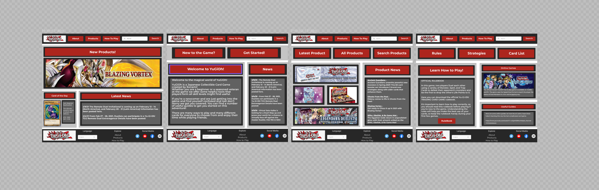

# King of Games

King of Games is a one stop webpage for all YuGiOh players to stay up to date with the latest products, news, and 
information. The reason for the creation of this project is due to a lack of accesibled user-friendly web pages
for YuGiOh. 

For my first Mile Stone Project I decided to draw inspiration from a hobby of mine. As a player myself 
I listed some features other pages where missing or were made to acess.

# Project Aim
## User Goals

* To encourage new players to learn the proper way of playing YuGiOh aswell as to make all the information they
need or might need easily accesible.

* All players to have a more accesible way of acquiring essential information about the 
game such as Rules, News, and New Products

* Make an easy to use web page so that all players all able to utilize it to its full capacity.

# User Feedback

1. As a new player and as someone who is not very good with technology I found the page very easy to use
and found all the information I needed to know aobut the game. I personally found the Card of the Day to be
a creative feature to interact and teach new players about the different cards.

2. I've been playing YuGiOh for almost 10 years now and I found myself visiting and recommending King of Games
to many of my friends aswell as to new players whenever we needed information for upcoming products.

3. I am a game shop owner and I have found this site higly useful. After telling my customers about the page 
I find myself no longer answering tedious questions like when is a proudct coming  out or when are events taking place.

# Design Process

* The main structure of the project started with the Home, About, Products, and How to Play pages as these 
were the fundamental pages I wanted to structure my webpage. I was also conflicted on the main logo for the header. 
The reason why it does not have the King of Games name and instead there is the iconic YuGiOh logo is so that 
new players can familiarize themselves with the brand and we decided we didn't want to take credit for any of the 
core items but instead pay homage to a game we respect and care for deeply. 

* Once I knew the main ideas were in place I went through a trial and error process using [Figma](figma.com). The early process
started with picking the righ color scheme that would set the tone and give character to my webpage. In the end I decided
to use base my color scheme on the famous YuGiOh logo using a dark brown/grey (#272727) for all my backgrounds and use a 
bright red (AD261D) to accent the headers and content aswell as a light grey (C4C4C4) as a light border used in the desktop
view of the page to add layering into my structure and not have it seem so bland and generic and for text content a nice grey background (616161)
was added to accent the text and make it more appealing to the viewer.

* I decided to make a template I had to follow for consistency and easy navigation throughout the page 
the main structure is as follows: using the light grey (C4C4C4) as a primary border then adding the darkbrown/grey (272727)
as a padding and on top a nice red background where the content can be higlighted and add character and energy to the page with 
a bright red (AD261D).

# Wireframing 
[My Early Build](https://www.figma.com/file/UjQH5fnCzuD4qrQENv8vcN/Mile-Stone-Project-1?node-id=0%3A1)

# Features

* The project has 4 pages which the user can acess by clicking on the correct button in the heading.

## Shared Features

* All the pages share the same template to maximize the speed and efficiency of navigation.

* All pages contain the content with their respective templates consisting of the above mentioned colors, paddings, and/or borders.

* The About, Products and How to Play all share a secondary heading which in future updates will allow the user to delve deeper into 
their respective subjects. 

## Home Page 

* The Home Page displays a large banner of the latest product to keep the user up to date.

* For Entertainment and Interactive purposes I decided to add a Card of the Day which displays a card with an enlarged 
description of the card.

* To keep the users up to date with the latest news I added a latest news into the home page for quick acess. 

## About Page 

* The before mentioned secondary heading was added to the about page for future updates to the webpage.

* To the left a nice welcome message is displayed here to encourage the user and introduce the user by gicing a brief explanation of what 
the game is.

* To the right another news display has been added this on although containing a little more news and events than the on at the home page.

## Products Page

* To the left of the screen is a product showcase displaying all the most recent aswell as upcoming products. 

* To the right of the screen there is a news display but unlike the one of the other pages this one is stritcly used for 
showing the most current product news. 

## How To Play 

* To the left of the screen we have a quick overview of the basic mechanics of the game aswell as a button which takes the user to an external rulebook
where all the rules are explored in further detail making it essential for new players.

* To the right the first display is an advertisement for online option of the YuGiOh in case the user is interested in having 
a new and fresh experience. 

* The second display to the right a quick link display which contains a link to a very useful tutorial of the rules and mechanics of the game.
The second link contains a nice comedic video to introduce the user to fellow members of the YuGiOh community. 

# Missing Features 

* For the sake of keeping the project simple yet efficient I decided to not include the more in depth pages which would've
been linked in the secondary heading.

* The searchbar is currently out of work but in the future it will allow the user to search for keywords to make the navigation
experience a much fluid and fast process. 

* In the footer the Change Language button is out of service but in our journey to unite and bring as many people together 
into this wonderful game the entire website will be available in different languages. 

# Technologies Used 

### HTML 5
* The Language used to create the structure and content of the website.

### CSS 
* The Language used to style all the page adding character and vibrance to the website.

### Bootstrap
* The Skeleton used to create the template of the website aswell as to make the mobile-first approach much simpler and effective.

### Figma 
* Used to create the sketch and test ideas for the web design.

### Font Awesome 
* Used to add amazing icons that beautifully help decorate my website.

### Google Fonts
* Used to add the custom fonts for all the text used in the website.

### W3C School
* A life saver and quick guide to solve the most simple of problems like centering of [Buttons](https://www.w3schools.com/howto/howto_css_center_button.asp)
aswell as [Styling Images](https://www.w3schools.com/css/css3_images.asp).

### Stack Overflow
* Great guide for more complex problems and questions like a quick guide for [Container Fluids](https://stackoverflow.com/questions/26204283/bootstrap-container-fluid-remove-margins-the-right-way-overflow)

# Testing 

* Speed of navigation when searching for the latest product news. Resuslts show a quick and smooth navigation experience helping the user
not waste time while he is in the middle of a duel.

* New Players have easy acess to all the information they need to get started and within a few clicks they are met with guides and 
the official rulebook.

## Validating the Code 

* To ensure the smoothest experience I validated the code in for both [HTML](https://validator.w3.org/) aswell as 
[CSS](https://jigsaw.w3.org/css-validator/)

## Browsers 

* Both me and my family tested the code in 
 1. Google Chrome
 2. Mozilla Firefox
 3. Safari
 4. Internet EWplorer

 ## Responsiveness

* The Responsiveness of the website was using both Google Developer Tools and family and friends who all tried the website
 and gave me their feedback.

 

